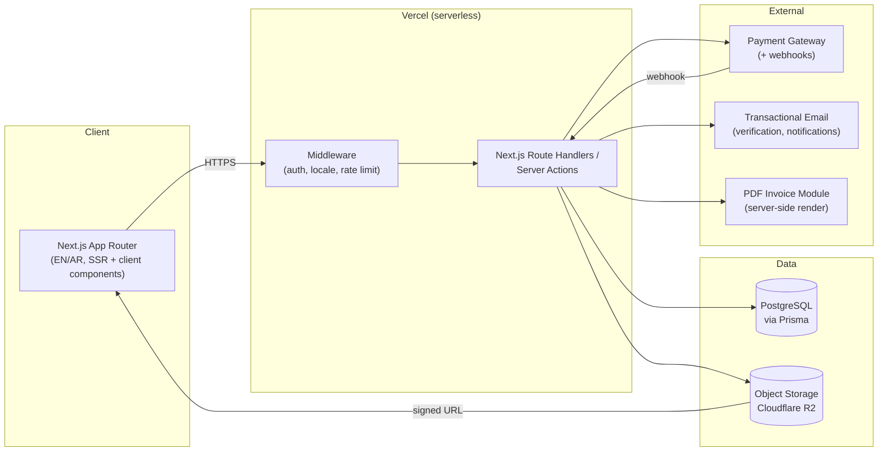

# Zingo Digital — Phase 1 Architecture & Approval Package

**Status: PENDING APPROVAL — no business logic has been implemented, per the Mandatory Approval
Gate in §21 of the Phase 1 Developer Brief.** This document, plus the scaffolded repository
structure delivered alongside it, is submitted for review before full implementation begins.

Version 1.0 · August 8, 2026

---

## 0. Prototype Review (Brief §2)

Reviewed: `IBRAHIMLUBBAD/Zingo-Digital` (8 static HTML files — `index`, `services`,
`service-detail`, `profile`, `dashboard`, `login`, `about`, `contact` — no build step, inline
CSS/JS per page).

| Keep | Rebuild | Why |
|---|---|---|
| Color, type, and spacing tokens (`--ink`, `--paper`, `--lime`, `--charcoal`, `--grey`, `--mint`; Space Grotesk / Inter / IBM Plex Mono) | Port 1:1 into `tailwind.config.ts` as theme extensions | Visual identity should carry over exactly — the brief asks us to preserve it, not restyle it |
| Page copy and information architecture (routes, section order, FAQ, roadmap content) | Port into React components/CMS-editable fields | Content is already right; only the delivery mechanism changes |
| `service-detail.html`'s field layout (upload, description, page range, turnaround) | Rebuild as the first schema-driven form rendered by the **Dynamic Service Form Engine** (§9 below) | It was already built as a generic template, not a one-off — that's the right shape, it just needs to read from `service_fields` instead of being hand-written |
| Dashboard's order/status/invoice layout | Rebuild as authenticated, data-bound components | Currently static mock data; structure and status vocabulary (New → … → Closed) are correct and match the brief exactly |
| Pixel/chevron motif, hero visual | Port as a reusable `<PixelHero>` / `<PixelGrid>` component | Reusable pattern, was previously duplicated as inline SVG per page |
| — | Everything else: routing, forms, auth, storage, payments, invoices | Prototype has zero backend — every dynamic feature the brief asks for starts from zero |

Nothing here needs a redesign. The rebuild is 100% about turning static markup into a real,
data-driven application behind the same look.

---

## 1. System Architecture



**Principle:** one Next.js codebase, clean internal module boundaries (`auth`, `db`, `storage`,
`payments`, `invoices`, `email`, `forms-engine`), so Phase 2–4 modules (QR, NFC, profiles,
subscriptions, website builder) plug into the same API layer instead of requiring a new backend.

---

## 2. Database Schema / ERD

Matches Brief §15, with `service_fields` as the engine behind the Dynamic Service Form.

```mermaid
erDiagram
    USERS ||--o{ ORDERS : places
    USERS ||--o| ADMIN_USERS : "is (optional)"
    CATEGORIES ||--o{ SERVICES : contains
    SERVICES ||--o{ SERVICE_FIELDS : defines
    SERVICES ||--o{ ORDER_ITEMS : "ordered as"
    ORDERS ||--o{ ORDER_ITEMS : contains
    ORDERS ||--o{ ORDER_FILES : has
    ORDERS ||--o{ ORDER_MESSAGES : has
    ORDERS ||--o{ ORDER_STATUS_HISTORY : has
    ORDERS ||--o| PAYMENTS : "paid via"
    ORDERS ||--o| INVOICES : generates
    ORDERS }o--o| COUPONS : "may use"
    USERS ||--o{ DISCOUNTS : "may have"

    USERS {
        uuid id PK
        string email UK
        string password_hash
        bool email_verified
        string first_name
        string last_name
        string phone
        timestamp created_at
    }
    ADMIN_USERS {
        uuid id PK
        uuid user_id FK
        string role "admin | manager | staff"
    }
    CATEGORIES {
        uuid id PK
        string name
        string slug UK
        int sort_order
    }
    SERVICES {
        uuid id PK
        uuid category_id FK
        string name
        string slug UK
        text description
        decimal base_price
        string currency
        int delivery_time_days
        bool active
        jsonb requirements
    }
    SERVICE_FIELDS {
        uuid id PK
        uuid service_id FK
        string key
        string label
        string type "text|textarea|number|date|select|checkbox|radio|url|email|phone|file"
        jsonb options
        bool required
        jsonb validation
        int sort_order
    }
    ORDERS {
        uuid id PK
        string order_number UK "ZG-2026-000125"
        uuid user_id FK
        string status
        decimal subtotal
        decimal discount_total
        decimal fee_total
        decimal total
        string currency
        timestamp created_at
        timestamp updated_at
    }
    ORDER_ITEMS {
        uuid id PK
        uuid order_id FK
        uuid service_id FK
        jsonb field_values
        decimal price
    }
    ORDER_FILES {
        uuid id PK
        uuid order_id FK
        uuid uploaded_by FK
        string kind "source|deliverable"
        string storage_key
        string filename
        string mime_type
        bigint size_bytes
        timestamp uploaded_at
    }
    ORDER_MESSAGES {
        uuid id PK
        uuid order_id FK
        uuid author_id FK
        string visibility "customer|internal"
        text body
        timestamp created_at
    }
    ORDER_STATUS_HISTORY {
        uuid id PK
        uuid order_id FK
        string from_status
        string to_status
        uuid changed_by FK
        timestamp changed_at
    }
    PAYMENTS {
        uuid id PK
        uuid order_id FK
        string status "pending|paid|failed|refunded"
        string provider
        string provider_ref UK
        decimal amount
        string currency
        timestamp created_at
    }
    INVOICES {
        uuid id PK
        uuid order_id FK
        string invoice_number UK
        string pdf_storage_key
        decimal total
        string currency
        timestamp issued_at
    }
    DISCOUNTS {
        uuid id PK
        uuid user_id FK
        string type "percent|fixed|first_order|loyalty"
        decimal value
        timestamp valid_from
        timestamp valid_until
        bool active
    }
    COUPONS {
        uuid id PK
        string code UK
        string type "percent|fixed"
        decimal value
        int usage_limit
        int usage_count
        timestamp valid_from
        timestamp valid_until
        bool active
    }
    NOTIFICATIONS {
        uuid id PK
        uuid user_id FK
        string type
        text body
        bool read
        timestamp created_at
    }
    SETTINGS {
        string key PK
        jsonb value
    }
```



**Phase 2+ tables (planned, not created yet):** `digital_profiles`, `digital_links`, `nfc_cards`,
`qr_codes`, `subscriptions`, `web_projects`, `websites`, `analytics_events`. Leaving these out of
the Phase 1 migration keeps the initial schema lean; foreign keys from `users` are anticipated but
not created until Phase 2.

**Cross-cutting rules:** every table gets `created_at`/`updated_at`; soft-delete via `deleted_at`
on `users`, `services`, `orders`; unique constraints on `order_number`, `invoice_number`,
`email`, `services.slug`; indexes on all foreign keys plus `orders.status` and `payments.status`.

---

## 3. Next.js Folder & Module Structure

```
zingo-digital/
├─ prisma/
│  ├─ schema.prisma
│  └─ migrations/
├─ src/
│  ├─ app/
│  │  ├─ [locale]/                     # "en" | "ar" — next-intl routing
│  │  │  ├─ layout.tsx                 # locale + direction (dir="rtl" for ar)
│  │  │  ├─ page.tsx                   # home
│  │  │  ├─ services/
│  │  │  │  ├─ page.tsx                # catalog (reads `services`+`categories`)
│  │  │  │  └─ [slug]/page.tsx         # service detail — renders Dynamic Form Engine
│  │  │  ├─ u/[username]/page.tsx      # public digital profile (Phase 2, stubbed now)
│  │  │  ├─ dashboard/
│  │  │  │  ├─ page.tsx                # order list
│  │  │  │  ├─ orders/[orderNumber]/page.tsx
│  │  │  │  ├─ invoices/page.tsx
│  │  │  │  └─ profile/page.tsx
│  │  │  ├─ login/page.tsx
│  │  │  ├─ register/page.tsx
│  │  │  ├─ about/page.tsx
│  │  │  └─ contact/page.tsx
│  │  ├─ admin/                        # separate auth-gated tree, own layout
│  │  │  ├─ layout.tsx
│  │  │  ├─ page.tsx                   # revenue/orders overview
│  │  │  ├─ services/                  # CRUD + field-builder UI
│  │  │  ├─ orders/
│  │  │  ├─ customers/
│  │  │  ├─ payments/
│  │  │  ├─ invoices/
│  │  │  ├─ discounts/
│  │  │  └─ settings/
│  │  └─ api/
│  │     ├─ auth/[...]/route.ts
│  │     ├─ orders/route.ts
│  │     ├─ orders/[id]/route.ts
│  │     ├─ orders/[id]/status/route.ts
│  │     ├─ orders/[id]/files/route.ts
│  │     ├─ services/route.ts
│  │     ├─ services/[id]/fields/route.ts
│  │     ├─ payments/create-intent/route.ts
│  │     ├─ payments/webhook/route.ts
│  │     ├─ invoices/[id]/route.ts
│  │     └─ files/[key]/download/route.ts
│  ├─ components/
│  │  ├─ ui/                           # buttons, inputs, cards — ports design tokens
│  │  ├─ forms-engine/                 # <DynamicServiceForm field={...} />
│  │  ├─ dashboard/
│  │  └─ marketing/                    # hero, category grid, roadmap — ports prototype sections
│  ├─ lib/
│  │  ├─ db.ts                         # Prisma client singleton
│  │  ├─ auth.ts                       # session/auth helpers
│  │  ├─ storage.ts                    # R2 client, signed URL helpers
│  │  ├─ payments.ts                   # gateway abstraction
│  │  ├─ invoices.ts                   # PDF generation module
│  │  ├─ email.ts                      # transactional email
│  │  └─ validation/                   # zod schemas per entity
│  ├─ messages/
│  │  ├─ en.json
│  │  └─ ar.json
│  └─ middleware.ts                    # locale negotiation + auth guard
├─ .env.example
├─ next.config.mjs
├─ tailwind.config.ts
└─ package.json
```

Business logic stays in `lib/`, never directly in route handlers or components — route handlers
validate input, call `lib/`, return a typed response.

---

## 4. API / Server Action Structure

| Endpoint | Method | Auth | Purpose |
|---|---|---|---|
| `/api/auth/register` | POST | Public | Create account, send verification email |
| `/api/auth/verify` | POST | Public (token) | Confirm email |
| `/api/auth/login` | POST | Public | Session login |
| `/api/auth/reset-password` | POST | Public (token) | Password reset |
| `/api/services` | GET | Public | List active services + categories |
| `/api/services/[id]/fields` | GET | Public | Field schema for the Dynamic Form Engine |
| `/api/orders` | POST | Customer | Create order from submitted field values |
| `/api/orders` | GET | Customer/Admin | List own orders (customer) / all orders (admin, filtered) |
| `/api/orders/[id]` | GET | Owner/Admin | Order detail, files, messages, status history |
| `/api/orders/[id]/status` | PATCH | Admin | Change status, writes `order_status_history` |
| `/api/orders/[id]/files` | POST | Owner/Admin | Upload source/deliverable file (signed upload) |
| `/api/files/[key]/download` | GET | Owner/Admin | Issue short-lived signed download URL |
| `/api/payments/create-intent` | POST | Customer | Start payment for an order total |
| `/api/payments/webhook` | POST | Gateway signature | Server-side payment confirmation — source of truth |
| `/api/invoices/[id]` | GET | Owner/Admin | Fetch/generate invoice PDF |
| `/api/admin/services` | POST/PATCH | Admin | Create/edit service + field schema, no code changes |
| `/api/admin/coupons` | POST/PATCH | Admin | Manage coupons, usage rules |

All endpoints: validate with `zod`, return consistent `{ data } | { error: { code, message } }`,
never trust client-supplied price/discount — always recomputed server-side.

---

## 5. Authentication & Authorization Plan

- **Method:** email + password (bcrypt/argon2 hash), email verification required before first
  order, password reset via time-limited signed token.
- **Sessions:** HTTP-only, secure, signed cookies (e.g. via `next-auth`/Auth.js credentials
  provider, or a lightweight custom session table) — no tokens in localStorage.
- **Roles:** `customer`, and `admin_users.role ∈ {admin, manager, staff}` (Brief §5, minimum
  Customer/Admin, with room for Manager/Staff per Spec §13).
- **Authorization rule:** every order/file/invoice query is scoped to `user_id = session.user.id`
  unless the session belongs to an admin role — enforced in `lib/auth.ts` helpers, never left to
  the client or to UI hiding alone.
- **Rate limiting:** login, register, and password-reset endpoints limited per IP + per account
  (e.g. Upstash/Vercel Edge Config rate limiter).
- **Admin area:** separate `/admin` layout with its own auth guard in `middleware.ts`; staff
  accounts cannot be self-registered — created by an existing admin only.

---

## 6. File Storage & Secure Download Plan

- **Storage:** Cloudflare R2 (S3-compatible), private bucket, no public read.
- **Upload flow:** client requests a signed upload URL from `/api/orders/[id]/files` → uploads
  directly to R2 → server records `order_files` row (key, filename, mime, size, uploader, order,
  kind = `source` or `deliverable`) only after a successful upload callback/confirmation.
- **Validation:** MIME allow-list and max size enforced both client-side (UX) and server-side
  (authoritative) before issuing the signed URL.
- **Download flow:** `/api/files/[key]/download` checks ownership/admin role, then issues a
  short-lived (e.g. 5–15 min) signed R2 URL — files are never served through the app server
  directly and never made public.
- **Separation:** source uploads and completed deliverables are distinguished by `kind`, so a
  customer only ever sees `deliverable` files as "your result," matching Spec §6/§8.

---

## 7. Payment Gateway, Webhook, Failure & Refund Plan

- **Gateway:** one primary provider selected per target market (Visa/Mastercard-capable), behind
  a `lib/payments.ts` abstraction so a second provider can be added later without touching order
  logic.
- **Flow:** order total is computed server-side → `create-intent` endpoint asks the gateway for a
  payment session → client completes payment on the gateway's hosted UI/SDK → gateway calls our
  **webhook**, which is the only place `payments.status` and `orders.status` actually flip to
  `Paid` — client-side "success" callbacks are treated as UX only, never as confirmation.
- **Webhook handling:** verify signature, idempotency-check `provider_ref` before writing, log the
  raw event, update `payments` row, append `order_status_history`, trigger invoice generation and
  customer notification.
- **Failure:** `payments.status = failed`, order stays in `Awaiting Payment`, customer can retry.
- **Refunds:** admin-initiated from the order/payment record → calls gateway refund API → webhook
  confirms → `payments.status = refunded`, order status updated, refund reflected on invoice
  record (credit note or status flag).
- **Never:** raw card data touches our servers; discount/price values are ever trusted from the
  client at checkout — always recomputed from `services`, `discounts`, and `coupons` server-side.

---

## 8. PDF Invoice Generation Plan

- Independent module (`lib/invoices.ts`), triggered by the payment webhook once
  `payments.status = paid`.
- Renders invoice number (`INV-2026-0091` style, sequential per year), date, customer details,
  Zingo Digital business details, line items from `order_items`, discounts, totals, currency, and
  payment method — matching Spec §11/§12.
- Output stored in R2 (private) with the same signed-download pattern as order files; `invoices`
  table stores the `pdf_storage_key`.
- Reusable enough to add a QR code to the invoice later (Spec §11) without changing the generation
  contract.

---

## 9. Dynamic Service Form Engine Architecture

- `services` own zero or more `service_fields`, each with `type`, `label`, `required`, `options`
  (for select/radio), and `validation` (jsonb — min/max, regex, file size/type).
- `<DynamicServiceForm serviceId>` fetches the field schema, renders the matching input component
  per `type` (text, textarea, number, date, select, checkbox, radio, url, email, phone,
  file-upload), and builds a `zod` schema **at runtime** from the same field definitions so
  client and server validation stay in sync.
- Submission produces `order_items.field_values` (jsonb) — no per-service database columns and no
  per-service page code, so admins add a new service by inserting rows, not by shipping code
  (Spec §9, Brief §6).
- `service-detail.html`'s current PDF-editing form becomes the first schema populated through this
  engine — visually identical, structurally generic.

---

## 10. Internationalization Plan (English / Arabic)

- **Library:** `next-intl` (App Router–native), locale segment `[locale]` (`en`, `ar`) on every
  public and dashboard route; `/admin` can stay English-only for Phase 1 if preferred, or share
  the same setup.
- **Direction:** `<html lang={locale} dir={locale === 'ar' ? 'rtl' : 'ltr'}>` set in the locale
  layout; Tailwind's logical properties (`ms-`, `me-`, `ps-`, `pe-` instead of `ml-`/`mr-`) used
  throughout so spacing mirrors correctly instead of needing a separate RTL stylesheet.
- **Content:** UI strings in `messages/en.json` / `messages/ar.json`; database-backed content
  (service names/descriptions, category names, field labels) stored as
  `{ "en": "...", "ar": "..." }` jsonb columns so admins can translate services without a deploy.
- **Fonts:** keep Space Grotesk/Inter for Latin; pair with an Arabic-supporting face (e.g. IBM
  Plex Sans Arabic, which shares a family with the existing IBM Plex Mono) so numerals/labels stay
  visually consistent between scripts.
- **Formatting:** dates, currency, and numerals formatted via `Intl` APIs per locale (Arabic
  numerals vs. Eastern Arabic numerals is a market decision to confirm — default to Western
  Arabic numerals unless the target market expects otherwise).
- **Launch scope:** architecture supports both from day one, per your instruction; content can
  still launch English-only first and backfill Arabic strings without a schema change, matching
  Spec §14's "support Arabic and English, even if the initial launch uses English only."

---

## 11. Future Compatibility (Phase 2–4)

No Phase 1 table or route blocks these — they're additive:

- **Phase 2:** `digital_profiles`, `digital_links`, `nfc_cards`, `qr_codes` tables; new
  `/[locale]/u/[username]` route (already reserved in the folder structure above, currently a
  placeholder); QR/NFC both resolve to the same public profile record.
- **Phase 3:** `web_projects`, `websites` tables; website builder as a new `app/[locale]/builder/`
  tree reusing the same auth/dashboard shell.
- **Phase 4:** `subscriptions`, `analytics_events` tables; subscription status gates feature access
  via the same `lib/auth.ts` authorization pattern already in place.

---

## 12. Security Checklist (Brief §14)

- [ ] HTTPS enforced in production (Vercel default + HSTS)
- [ ] Password hashing via bcrypt/argon2, sessions HTTP-only + secure + signed
- [ ] Server-side authorization on every order/file/invoice/admin query
- [ ] Private object storage, signed URLs only, source vs. deliverable separated
- [ ] Zod validation on every API input; file type/size checked server-side
- [ ] Rate limiting on auth + payment-adjacent endpoints
- [ ] Audit log table for status changes, discount grants, and refunds
- [ ] Secrets only in environment variables, never committed
- [ ] Payment confirmation only via verified webhook, never client callback

---

## 13. Development Roadmap & Estimated Timeline

Estimates assume one full-stack developer at standard pace; parallelizing frontend/backend can
compress elapsed time but not total effort.

| Milestone | Scope | Est. effort |
|---|---|---|
| M0 — Setup | Repo, CI, environments, Prisma schema, i18n scaffold, design tokens ported to Tailwind | 3–4 days |
| M1 — Auth | Register, verify, login, reset, sessions, roles | 4–5 days |
| M2 — Services & Form Engine | Category/service CRUD (admin), field schema, `<DynamicServiceForm>` | 6–8 days |
| M3 — Orders & Files | Order creation, status machine + history, file upload/download via R2 | 6–8 days |
| M4 — Payments & Invoices | Gateway integration, webhook, PDF invoice module | 6–8 days |
| M5 — Dashboards | Customer dashboard, admin dashboard (orders, customers, revenue overview) | 6–7 days |
| M6 — Discounts/Coupons | Discount + coupon rules, server-side enforcement | 2–3 days |
| M7 — i18n pass | Arabic content, RTL QA across all pages | 3–4 days |
| M8 — Hardening & Launch | Security checklist, rate limiting, audit logs, staging → production | 4–5 days |

**Total: ~40–52 working days** (roughly 8–10 weeks) for a complete, acceptance-criteria-passing
Phase 1, excluding Phase 2+ modules. Payment gateway selection and any legal review for
document/licensing services (Spec §2, §26) can run in parallel and should be confirmed before M4.

---

## Approval

This package covers all eight items required by §21 of the Phase 1 Developer Brief. Pending your
review and sign-off, implementation begins at **M0** in the order above — core (orders / files /
payments / invoices) before any Phase 2+ module, per the brief's own implementation principle.

Open questions for you to confirm before M0 starts:
1. Payment gateway/market — which provider(s) should `lib/payments.ts` target first?
2. Object storage — confirm Cloudflare R2, or a preferred alternative?
3. Arabic numerals — Western (`123`) or Eastern Arabic (`١٢٣`) for the `ar` locale?
4. Admin area — should `/admin` also ship bilingual in Phase 1, or English-only for now?
